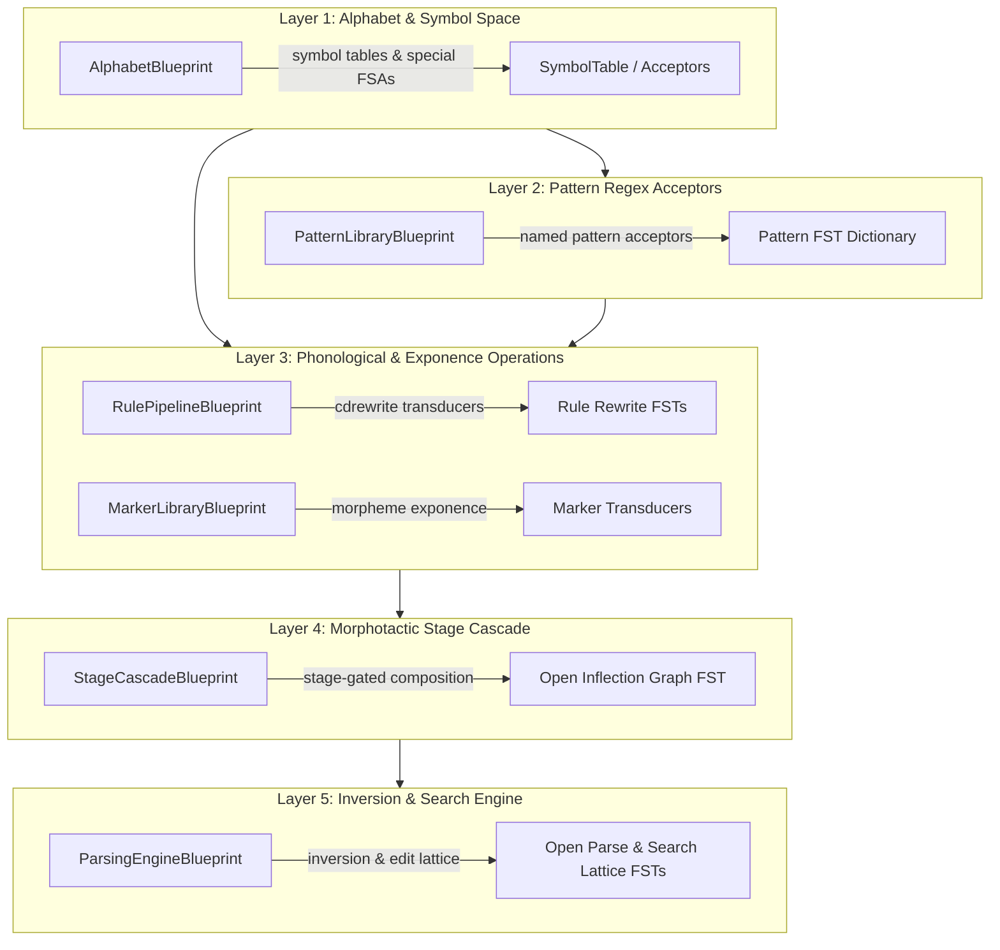

# parC

**parC** is a toolkit for building and applying morphological analyzers (finite-state-transducer-based parsers) from linguistic fieldwork data.

---

## Overview

`parC` processes language grammar specifications defined in structured YAML configuration files into executable Finite State Transducers (FSTs) using `pynini`.

---

## 5-Layer FST Blueprint Architecture

The FST compilation pipeline is organized into a domain-aware 5-layer blueprint hierarchy (`src/grammar/blueprints/`):

### Blueprints Summary

- **Layer 1: `AlphabetBlueprint` (`src/grammar/blueprints/alphabet.py`)**  
  Manages phone inventory, feature tags (`[feat=val]`), edit symbols, boundary markers, and the central `pynini.SymbolTable`.
- **Layer 2: `PatternLibraryBlueprint` (`src/grammar/blueprints/patterns.py`)**  
  Compiles named phonological pattern regex acceptors (`<Consonants>`, `<Vowel>`) using recursive descent.
- **Layer 3: `RulePipelineBlueprint` & `MarkerLibraryBlueprint` (`src/grammar/blueprints/transducers.py`)**  
  Compiles phonological rewrite rules (`pynini.cdrewrite`) and morphological exponence markers.
- **Layer 4: `StageCascadeBlueprint` (`src/grammar/blueprints/paradigms.py`)**  
  Handles stage-gated transducer generation and left-to-right composition for inflection graphs.
- **Layer 5: `ParsingEngineBlueprint` (`src/grammar/blueprints/parser.py`)**  
  Inverts inflection graphs into parse graphs and constructs fuzzy search lattices.

For detailed design specifications, see [`backlog/docs/architecture/doc-1 - Layered-FST-Compilation-Architecture.md`](file:///Users/julietmcvicker/code/parC/backlog/docs/architecture/doc-1%20-%20Layered-FST-Compilation-Architecture.md).

---

## Development

- **Validate Schemas**: `PYTHONPATH=. python -m parC.yaml_utils.schema_validation`
- **Run Tests**: `pytest`
