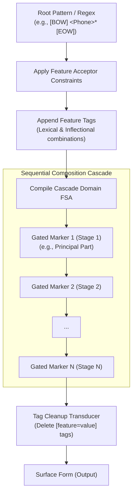

# Paradigm Inflection FST Structure

This document details the compilation structure of the inflection Finite State Transducer (FST) generated for a paradigm in `parC`. 

The core logic is implemented in the function [`build_inflect_graph_for_root_regex`](file:///Users/charlesmcvicker/code/parC/parC/grammar/paradigm_compilation.py#L194) in `parC/grammar/paradigm_compilation.py`.

---

## Architecture Overview

The paradigm inflection FST maps an input representation consisting of a root form and grammatical features to an inflected surface form:

$$\text{Root} + \text{Lexical Features} + \text{Inflectional Features} \xrightarrow{\text{FST Cascade}} \text{Surface Form}$$

To avoid state-space explosion and handle dependencies between morphosemantics and phonological realization, `parC` builds a **sequential composition cascade** of gated transducer stages.

### 1. Cascade Input Domain
For a given paradigm and root regex (or open root pattern like `<Phone>*`):
1. The root is wrapped with boundary symbols: `[BOW] root [EOW]`.
2. All valid combinations of lexical features and inflectional features are appended as a sequence of feature tags: `[feature=value]`.
3. Feature constraints are applied to the root acceptor (`_apply_feature_acceptor_constraints`).
4. The union of all possible input paths is compiled into the initial `cascade_domain`.

### 2. Sequential Composition Cascade
Rather than composing a single monolithic FST, `parC` processes morphological markers sequentially. All markers are sorted by their `stage` definition (e.g., `principal_part` first, followed by sequential stages).

For each marker, a **gated FST** is constructed:
- **Trigger Path**: Composes `sigma_star` + triggering tag sequence with the marker's specific transducer (`get_marker_fst(marker)`).
- **Non-Trigger Path**: Matches inputs that do *not* contain the triggering tags (using static tag difference) and passes them through unmodified.
- **Gated Union**: The gated FST is the union of the trigger and non-trigger paths:
  $$\text{Gated FST} = (\text{Trigger FSA} \circ \text{Marker Transducer}) \cup \text{Non-Trigger FSA}$$

This gated FST is composed sequentially with the running cascade FST.

### 3. Tag Cleanup
After all marker stages are composed, a cleanup transducer deletes all feature tags `[feature=value]` from the output tape using context-dependent rewriting (`pynini.cdrewrite`).

---

## Mermaid Workflow Graph

---

## Caching Analysis & Recommendations

Currently, `parC` caches the final compiled paradigm FSTs (`inflect`, `parse`, etc.) on disk. However, compiling the cascade for large paradigms with many feature combinations and markers can still be a bottleneck. Below is an analysis of what sub-FSTs can be cached to optimize build times.

### 1. Base Marker Transducers (`get_marker_fst(marker)`)
- **Description**: The FST that performs the actual phonological rewrite or insertion/deletion for a single morpheme/marker.
- **Caching Recommendation**: **High priority**. These are highly reusable across different paradigms and roots, and depend only on the marker definition and phonological rules.

### 2. Gated Marker Transducers (`gated_fst`)
- **Description**: The transducer that wraps a marker with its trigger and non-trigger conditions:
  $$\text{gated\_fst} = (\text{trigger\_fsa} \circ \text{base\_fst}) \cup \text{non\_trigger\_fsa}$$
- **Caching Recommendation**: **Medium priority**. Although they are specific to a paradigm (because the trigger/non-trigger tags depend on the paradigm's specific feature combinations), caching them within the scope of a paradigm build or across incremental updates of the same paradigm can save significant composition and optimization time.

### 3. Feature Acceptor Constraints
- **Description**: Acceptor constraints compiled from `FeatureDefinitions` (via `get_feature_acceptor_fsts()`).
- **Caching Recommendation**: **High priority**. These are static for the language inventory and features, independent of specific paradigms or roots.
